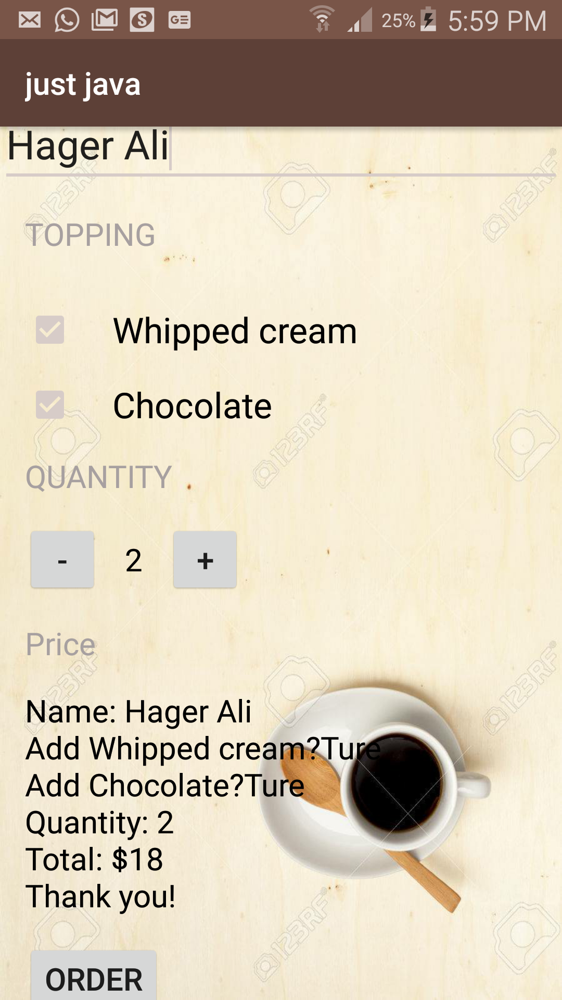

# coffee-ordering-app

### A simple app that mimics ordering coffee through mail. 
### This app is made during the Udacity Android for Beginners course.

## Describtion
* the user can choose the topping and the quantity of the coffee and then press order to display the price and ask the user if he/she wants to send the order through mail.

